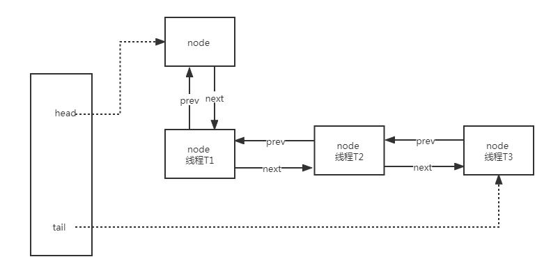
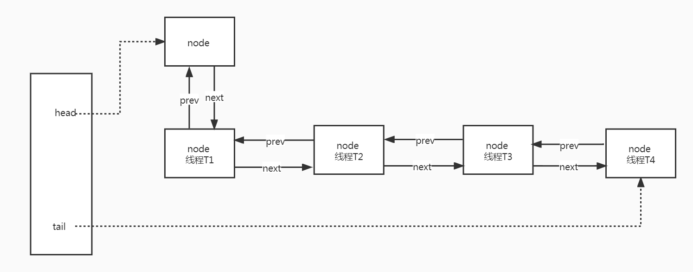
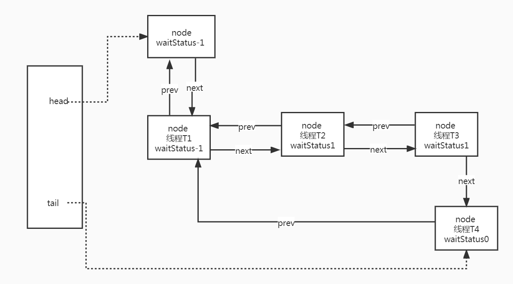
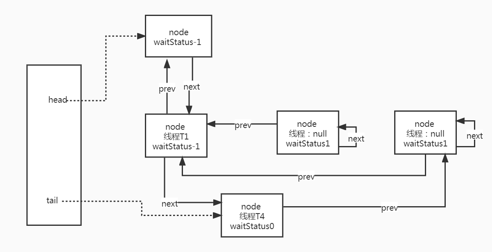
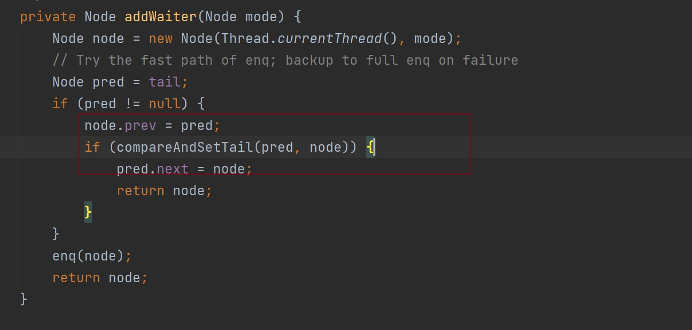

# AbstractQueuedSynchronizer源码解析

## 基本字段介绍

AQS，又叫作队列同步器，是构建众多同步组件的基础框架。依赖于一个原子变量来表示同步状态，通过**模板方法**，各子类继承并实现它提供的抽象方法来管理同步状态。

### 同步状态
使用volatile来修饰，默认为0，标识锁空闲；state>0表示锁被持有，可以大于1，表示同一线程可以多次获取锁，即**可重入**

**线程通过修改state>0**，修改成功即表示获取锁。
```java
private volatile int state;

```
AQS内部改变该状态通过使用Unsafe类来实现的，使用CAS乐观锁来更新状态。避免使用synchronized悲观锁
> java中不能直接访问操作系统底层，Unsafe提供了硬件级别的原子访问，通过compareAndSwapXXX比较对象偏移量内存位置上的值和期望值，来判断是否更新的。
```java
//获取state在内存中的偏移量
private static final Unsafe unsafe = Unsafe.getUnsafe();
private static final long stateOffset;

static {
    try {
        stateOffset = unsafe.objectFieldOffset(AbstractQueuedSynchronizer.class.getDeclaredField("state"));
                    ...
    } catch (Exception ex) { throw new Error(ex); }
}
//利用CAS来更新state值，若当前state的值 == expect，则更新state = update；否则false 
protected final boolean compareAndSetState(int expect, int update) {
    return unsafe.compareAndSwapInt(this, stateOffset, expect, update);
}
```
## lock.lock()
本文以ReentrantLock为例来分析。ReentrantLock是一个独占锁，内部主要通过Sync类来实现公平锁和非公平锁的，默认非公平。Sync又继承了AbstractQueuedSynchronizer，所以底层是通过AQS来实现的。
`abstract static class Sync extends AbstractQueuedSynchronizer `
```java
public ReentrantLock(boolean fair) {
	sync = fair ? new FairSync() : new NonfairSync();
}
```
我们先看非公平锁（NonfairSync）的lock方法。方法很好理解：先通过CAS设置同步状态的值，设置成功，则将当前锁的持有者设为自己；否则则执行acquire()方法。
AbstractOwnableSynchronizer主要是标明当前锁的持有者是哪个线程，主要用来实现独占功能的。
```java
final void lock() {
    //cas更新state值，上面分析过
    if (compareAndSetState(0, 1))
        //设置当前线程持有锁   
        setExclusiveOwnerThread(Thread.currentThread());
    else
        acquire(1);
}
```
### acquire
用来获取独占锁，且忽略中断。
1. 调用tryAcquire，来尝试再次通过CAS获取锁
2. 获锁失败后将线程包装成Node节点加入到**同步队列**中
3. 阻塞线程直到线程**中断或者被唤醒**
```java
public final void acquire(int arg) {
    if (!tryAcquire(arg) &&
        acquireQueued(addWaiter(Node.EXCLUSIVE), arg))
        selfInterrupt();
}
```

### tryAcquire
此方法还是比较容易理解的，区分公平锁和非公平锁实现，主要看非公平的
```java
final boolean nonfairTryAcquire(int acquires) {
    final Thread current = Thread.currentThread();
    //先看当前锁是否空闲，若空闲则CAS设置state，成功则抢到锁
    int c = getState();
    if (c == 0) {
        if (compareAndSetState(0, acquires)) {
            setExclusiveOwnerThread(current);
            return true;
        }
    }
    //若当前锁非空闲，则判断占锁的线程是否为当前线程。是则将state+1（重入锁）
    else if (current == getExclusiveOwnerThread()) {
        int nextc = c + acquires;
        if (nextc < 0)
            throw new Error("Maximum lock count exceeded");
        //此时锁被当前线程占用，不会出现并发情况。所以直接设置state即可，无需通过CAS    
        setState(nextc);
        return true;
    }
    return false;
}
```
讲完获锁成功这部分的逻辑后，接下来我们来看下，获锁失败是如何处理的。

### 同步队列
AQS中主要通过一个同步双向队列来完成线程获取资源的排队工作。当线程获锁失败时，会将该线程加入到同步队列中。**线程的控制信息被保持在其上一个节点中**。

我们这边主要讨论 watiStatus = -1、0、1这3种情况。
```java
static final class Node {
	//标记是否为共享还是独占模式
    static final Node SHARED = new Node();
    static final Node EXCLUSIVE = null;

	/**
	等待状态： waitStatus默认为0(初始化状态)
    CANCELLED-1(后面也会出现waitState>0)：节点为取消状态，即节点对应的线程中断或者超时，需要从队列中移除。且后续不再参与获锁活动
    SIGNAL--1：主要用来标明后继节点为等待状态。节点在队列中等待，必要条件为：其前继节点为SIGNAL(具体在shouldParkAfterFailedAcquire)。当前节点释放锁或者被取消时，会唤醒后继节点(具体在cancelAcquire和release)
    CONDITION--2：Condition中使用，节点在等待队列中等待被唤醒
    PROPAGATE--3：共享模式下才会使用
	**/
    static final int CANCELLED =  1;
    static final int SIGNAL    = -1;
    static final int CONDITION = -2;
    static final int PROPAGATE = -3;

    volatile int waitStatus;
	//前继节点
    volatile Node prev;
	//后继节点
    volatile Node next;
	//当前节点对应的线程
    volatile Thread thread;
} 	
```
### addWaiter
下面是同步队列的示意图

其中的head和tail分别代表头尾节点，它们都是懒加载
head节点除了初始化之外，只能通过setHead方法来修改。**如果头节点存在，那么它的waitStatus不可能为CANCELLED**，且头节点只是一个虚节点，只表示有线程占用了锁，且该节点下不对应线程。数据节点真正从第二个节点开始。

```java
private transient volatile Node head;
private transient volatile Node tail;
```
addWaiter本质就是一个在队列最后添加一个尾节点的操作
```java
//主要是新建一个node并把它加入到队尾。入参标识释放为共享锁,独占为null。
private Node addWaiter(Node mode) {
    Node node = new Node(Thread.currentThread(), mode);
    Node pred = tail;
    //如果尾结点不为空，将当前节点设置为尾结点
    if (pred != null) {
        node.prev = pred;
        //CAS设置当前节点为尾结点，同state，使用的unsafe
        if (compareAndSetTail(pred, node)) {
            pred.next = node;
            return node;
        }
    }
    //如果尾节点为空或者CAS设置当前节点为尾结点失败
    enq(node);
    return node;
}
```
如果尾节点为空，则队列还未初始化，需要先初始化头节点和尾结点
```java
private Node enq(final Node node) {
    for (;;) {
        Node t = tail;
        if (t == null) { 
        //初始化头节点，注意初始化的头节点并不是当前线程的节点，而是使用无参构造函数
            if (compareAndSetHead(new Node()))
        //此时队伍中只有一个头节点，将尾结点指向该节点
                tail = head;
        } else {
        //自旋设置当前节点为尾节点
            node.prev = t;
            if (compareAndSetTail(t, node)) {
                t.next = node;
                return t;
            }
        }
    }
}
```
执行完addWorker之后，线程入队列成功。至于节点后续如何，以及何时出队列，我们来看下acquireQueued方法
### acquireQueued
首先线程入队列之后，是马上进行阻塞吗？阻塞意味着需要从用户态切换到内核态，唤醒时需要从内核态切换到用户态，开销较大。所以AQS先是让线程自旋竞争锁。但是如果锁被其他线程占着，一直自旋也不行。所以通过其前一节点的waitStatus来判断是否需要自旋还是阻塞。
```java
final boolean acquireQueued(final Node node, int arg) {
	//是否成功拿到锁
   boolean failed = true;
   try {
       boolean interrupted = false;
       //自旋：线程被中断或者被唤醒（除刚进入该方法）
       for (;;) {
           final Node p = node.predecessor();
           //1.前一节点为头节点，且竞争锁（执行完释放锁或者被interrupt）
           if (p == head && tryAcquire(arg)) {
               //将当前节点设置为头节点，原头节点出列
               setHead(node);
               //原头节点没有可达性，会被垃圾回收
               p.next = null; 
               //成功获取到锁
               failed = false;
               //返回线程是否被中断过
               return interrupted;
           }
           //2.前节点不为头节点，或者获锁失败
    //此时需要判断当前节点是否需要被阻塞（阻塞必要条件是：前继节点的状态为SIGNAL。）防止无限自旋浪费资源
           if (shouldParkAfterFailedAcquire(p, node) &&
               parkAndCheckInterrupt())
               //记录等待过程中是否被中断，只要中断一次也算
               interrupted = true;
       }
   } finally {
   		//添加失败会执行该方法，park时候需要不可预知异常，或者调用doAcquireSharedInterruptibly，此处只是一个保险代码，确保节点拿到锁或者被取消
       if (failed)
           cancelAcquire(node);
   }
}
```
先看第一步：获锁成功，将当前节点设为头节点。此时获得锁的只有当前线程，故不存在并发问题，无需CAS操作。头节点是虚节点，不保存除waitStatus、next以外的其他信息，此处将thread和prev都清空。
因为当前线程获取到锁，线程的信息保存在exclusiveOwnerThread中。
```java
private void setHead(Node node) {
   head = node;
   node.thread = null;
   node.prev = null;
}
```

接着看第二步，获锁失败，判断是否应该阻塞
### shouldParkAfterFailedAcquire
**当前节点的线程是否应该被阻塞，主要看前节点是否为SIGNAL**
如果前节点状态是取消状态，则将prev指针指向前面最近的不为取消状态的节点。
```java
private static boolean shouldParkAfterFailedAcquire(Node pred, Node node) {
	//1.如果前节点为SIGNAL，则当前节点可以被阻塞，直接返回
   int ws = pred.waitStatus;
   if (ws == Node.SIGNAL)
       return true;
   //2.前节点为取消状态
   if (ws > 0) {
       do {
       //将取消节点从队列中剔除，目前只剔除了tail ——>head这条方向(即prev)
           node.prev = pred = pred.prev;
       } while (pred.waitStatus > 0);
       pred.next = node;
   } else {
   		//3.将前节点设置为SIGNAL，后面线程自旋又会走到第一步
       compareAndSetWaitStatus(pred, ws, Node.SIGNAL);
   }
   return false;
}
```
第二步有点绕，我画个图再解释下：

假设此时队列中有4个节点，节点T2、T3为取消状态，（取消见cancelAcquire）

### parkAndCheckInterrupt
该方法主要是挂起线程的
```java
private final boolean parkAndCheckInterrupt() {
   //线程进入waiting状态，挂起当前线程
   //恢复的条件有：1.调用unpark 2.线程中断 3.不可预知错误 （该方法不会抛出异常）
   LockSupport.park(this);
   //返回线程是否被中断了(会消耗中断标识)
   return Thread.interrupted();
}
```
### cancelAcquire
正常不会执行到该步，但是当调用park遇到问题或者调用诸如doAcquireNanos之类的方法直接抛出异常时，不走获锁成功流程。为了确保节点能够从队伍中正常移除，需要执行该方法
```java
private void cancelAcquire(Node node) {
   if (node == null)
       return;
   //清除失效节点的线程    
   node.thread = null;
	//和上面一样，将node的prev指向之前第一个非取消节点，剔除prev方向的失效节点
   Node pred = node.prev;
   while (pred.waitStatus > 0)
       node.prev = pred = pred.prev;
	//经过滤后的前节点（P）的next节点
   Node predNext = pred.next;
	//将当前节点设为取消
   node.waitStatus = Node.CANCELLED;
	//如果当前节点是尾节点，则使用CAS将过滤后的（P）设为tail
	//如果cas成功，则将（P）的next置为空
   if (node == tail && compareAndSetTail(node, pred)) {
       compareAndSetNext(pred, predNext, null);
   } else {
   //如果当前不是尾节点，或者设置（P）为尾节点失败（即当前节点有后继节点）
   //取消当前节点，那么就需要将（P）的next指向当前节点的后继节点，这边做的主要是剔除next方向的失效节点
   //前面讲过唤醒或者阻塞节点，所以在设置（P）的后继节点时候，需要确保（P）是SIGNAL
       int ws;
       if (pred != head &&
           ((ws = pred.waitStatus) == Node.SIGNAL ||
            (ws <= 0 && compareAndSetWaitStatus(pred, ws, Node.SIGNAL))) &&
           pred.thread != null) {
           Node next = node.next;
           if (next != null && next.waitStatus <= 0)
               compareAndSetNext(pred, predNext, next);
       } else {
       //其他情况我们需要唤醒头节点后继节点(后面释放锁再讨论)
           unparkSuccessor(node);
       }
       node.next = node; // help GC
   }
}
```
执行完大致成这个样子：

后面当T1不可达时，取消节点也会被垃圾回收

## lock.unlock
释放锁，将state设置为0
```java
public final boolean release(int arg) {
	//尝试释放锁成功
   if (tryRelease(arg)) {
       Node h = head;
       if (h != null && h.waitStatus != 0)
           //锁释放成功，唤醒head之后的节点来竞争锁
           unparkSuccessor(h);
       return true;
   }
   return false;
}
```
唤醒节点的条件为：h != null && h.waitStatus != 0 的原因是：
1. 如果h == null，头节点还没有被初始化，即还没有节点加入到队列，故不需要唤醒
2. 如果h != null && h.waitStatus == 0，说明后继节点还在自旋竞争锁，还未被阻塞故不需要唤醒
3. 头节点不存在取消状态，故waitStatus不会大于0
### tryRelease
```java
protected final boolean tryRelease(int releases) {
		//减少重入次数
    int c = getState() - releases;
    //当前线程没有持有锁，尝试释放锁肯定抛异常
    if (Thread.currentThread() != getExclusiveOwnerThread())
        throw new IllegalMonitorStateException();
    boolean free = false;
    //持有线程全部释放，当前锁没有线程占有，释放exclusiveOwnerThread
    if (c == 0) {
        free = true;
        setExclusiveOwnerThread(null);
    }
    //此时只有当前线程持有锁，setStatus不存在并发问题，直接设值
    setState(c);
    return free;
}
```
### unparkSuccessor
```java
private void unparkSuccessor(Node node) {
		//正在唤醒后继节点，将head的waitStatus恢复默认值，这样后继节点在获锁的时候，可以再次尝试获取一次（acquireQueued），CAS设置失败也不影响唤醒操作
    int ws = node.waitStatus;
    if (ws < 0)
        compareAndSetWaitStatus(node, ws, 0);
		//获取队列中第一个非取消的节点
    Node s = node.next;
    //节点为空，或者为取消状态
    if (s == null || s.waitStatus > 0) {
        s = null;
        //从tail往前查第一个非取消节点
        for (Node t = tail; t != null && t != node; t = t.prev)
            if (t.waitStatus <= 0)
                s = t;
    }
    if (s != null)
        LockSupport.unpark(s.thread);
}
```
为什么从tail往前查是因为前面addWait插入节点不是原子操作，具体是：

如果unparkSuccessor刚好在此时执行，可能head可能找不到后继节点
## 公平锁与非公平锁
主要区别在于lock()与tryAcquire()方法上面，公平锁会优先判断等待队列中是否有节点，而非公平锁则直接进行抢占资源，抢占失败才会加入到等待队列中。